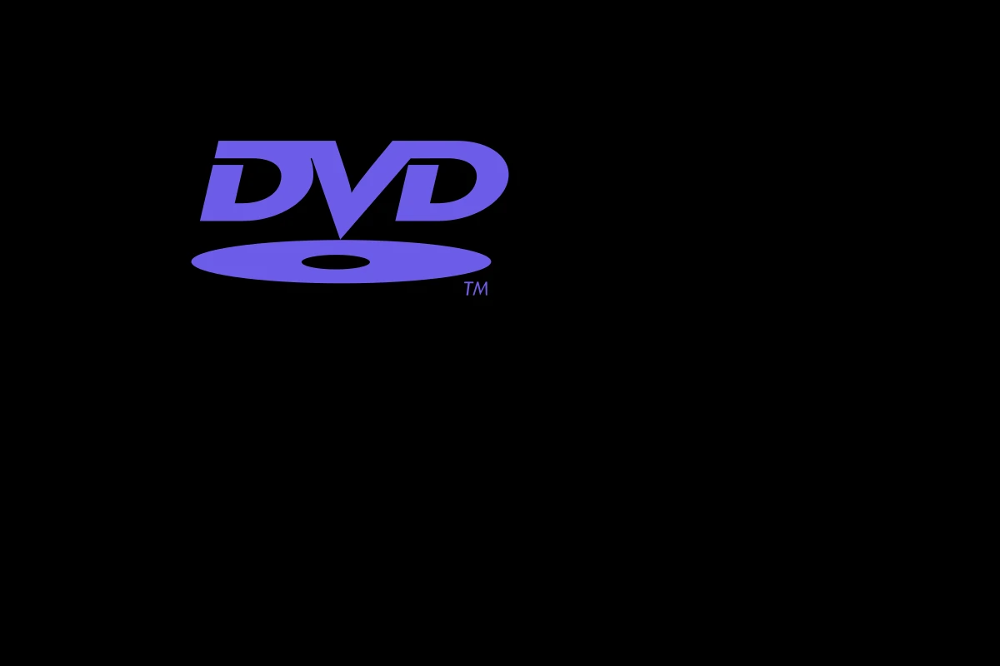
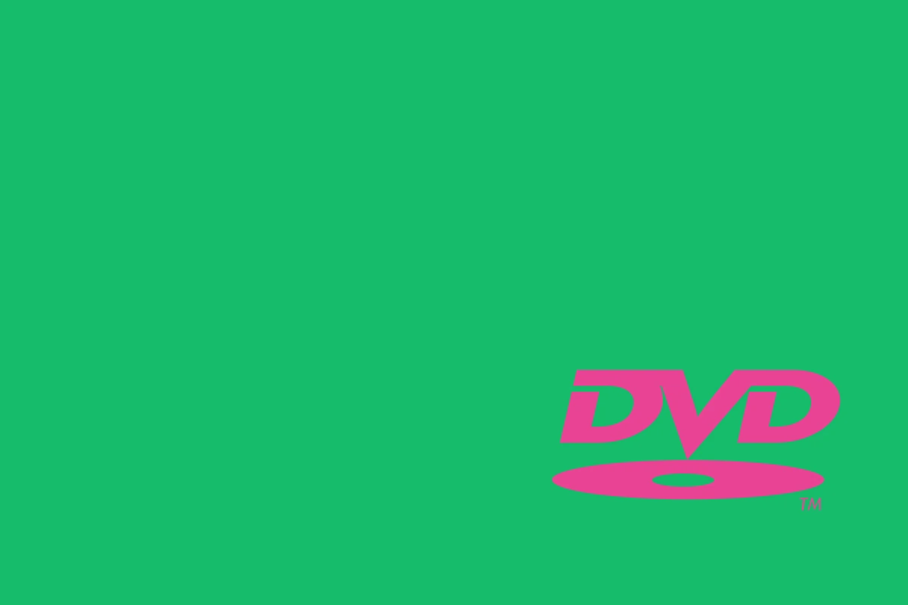
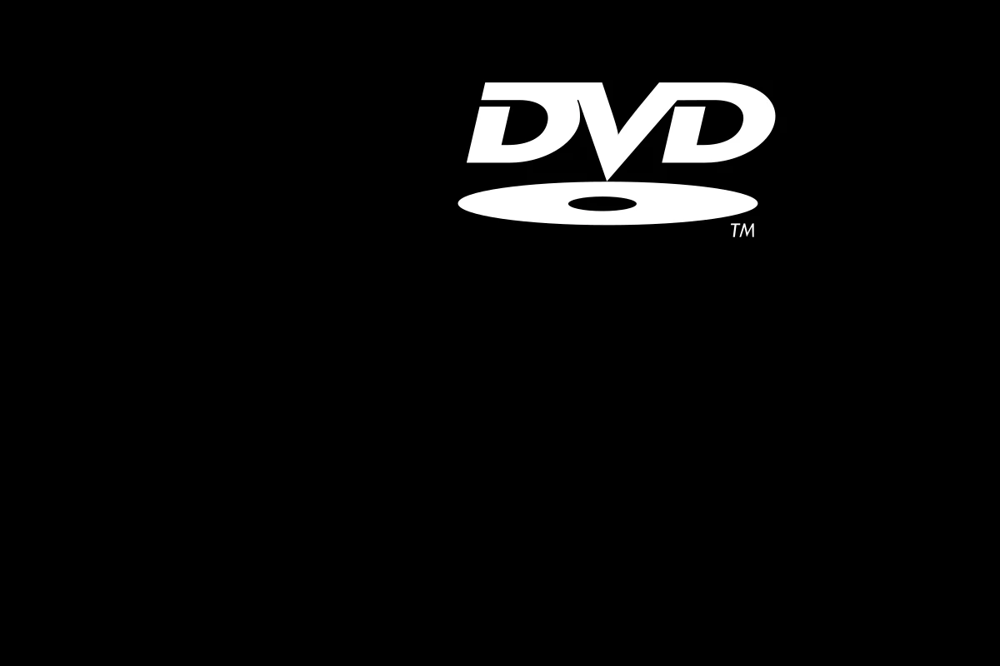

# Scranton DVD

A macOS screensaver. The DVD logo bounces around your screen, changing colour when it hits the edges.

## Modes

| Classic | Colorful | Monochrome |
|---|---|---|
|  |  |  |
| Coloured logo on black | Coloured logo on inverted background | White logo on black |

Switch modes via the Options button in System Settings > Screen Saver.

## Build

Requires Swift (Xcode Command Line Tools).

```
./build.sh
```

Outputs `Scranton DVD.saver`, a universal binary (arm64 + x86_64) targeting macOS 13+.

## Install

Double-click `Scranton DVD.saver`, or:

```
cp -r "Scranton DVD.saver" ~/Library/Screen\ Savers/
```

macOS may prompt you to approve the unsigned screensaver in System Settings > Privacy & Security.

### Thumbnail not showing in the picker?

macOS Sonoma+ caches screensaver thumbnails per bundle. Reinstalling the same bundle keeps the empty cached entry. Bust the cache:

```
killall WallpaperAgent 2>/dev/null
rm -rf "$(getconf DARWIN_USER_CACHE_DIR)/com.apple.wallpaper.extension.legacy/com.apple.wallpaper.legacy.thumbnails/"*
```

Then reopen System Settings > Screen Saver.

## Uninstall

```
rm -rf ~/Library/Screen\ Savers/Scranton\ DVD.saver
```

## Trivia

The cold open of "Launch Party" (The Office, Season 4, Episode 5, aired October 11, 2007) was written by Jennifer Celotta and inspired by a real moment in the writers' room, where they had argued for ages about whether the DVD logo would hit the corner. On screen, the office watches the logo bounce on the conference room TV behind Michael, waiting for the perfect corner hit.

The catch: there was no logo on the TV during filming. The cast reacted to a blue screen, and a bouncing logo was added in post-production, timed to nail the corner on cue. The most famous corner-hit in television history was an edit.

The other catch: the logo on the TV in the show isn't the swooshy one this screensaver recreates. The production swapped in a square "DVD VIDEO" badge instead, because a square logo can actually tuck flush into a screen corner. The real swooshy logo, with its irregular silhouette, would have never lined up cleanly enough to sell the moment.

## License

MIT
